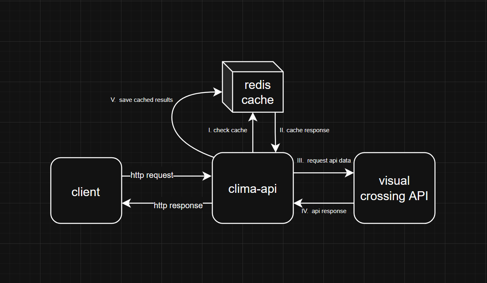

# Clima API

This project is a **Java REST API** that provides weather forecast data using the Visual Crossing Weather API. It is designed to be deployed in a Docker container running Tomcat, with Redis used for caching.


## Features

✅ Exposes an HTTP endpoint to retrieve weather forecasts  
✅ Queries **Visual Crossing Weather API** for real weather data  
✅ Uses **Redis** as an in-memory cache to reduce external API calls  
✅ Supports configurable rate limiting (per IP and global daily limits)  
✅ Packaged as a `.war` file and runs on Tomcat 10 with Docker Compose

---

## 📌 Architecture

- Java Servlet-based REST API (using `HttpServlet`)
- Redis as a fast in-memory cache
- Jackson for JSON serialization/deserialization
- Apache HttpClient 5 for HTTP requests
- Apache Tomcat 10.x as the servlet container

---

## 📌 Endpoint

```http
GET /clima
```
**Query Parameters:**
 - **cidade (required):** The name of the city for which to fetch the weather forecast.
Returns a JSON weather forecast for the specified city.

---
## 📌 High-Level Flow

Simplified diagram:

```markdown
Client HTTP request
    ↓
Servlet (ClimaServlet)
    ↓
ClimaService
    ↓
Check Redis cache
       ↳ HIT  → Return cached response
       ↳ MISS  → Call Visual Crossing
                ↓
        Store in Redis (with TTL)
                ↓
        Return response to client
```
---
## 📌 Build & Run
### 1️⃣ Clone the repository
```sql
git clone https://github.com/julioCK/clima-api.git
cd clima-api
```
### 2️⃣ Package the application as a .war
```sql
mvn clean package
```
- This generates target/clima-api-1.0-SNAPSHOT.war.
### 3️⃣ Run with Docker Compose
```sql
docker-compose up --build
```
Docker Compose will start:

- A Tomcat container with your .war deployed
- A Redis container for caching
- ### Access the API at `http://localhost:8080/clima`

### 📌 Rate Limiting

- Global daily limit: 1000 calls to Visual Crossing
- Per-user (IP-based) limit: 10 calls per hour